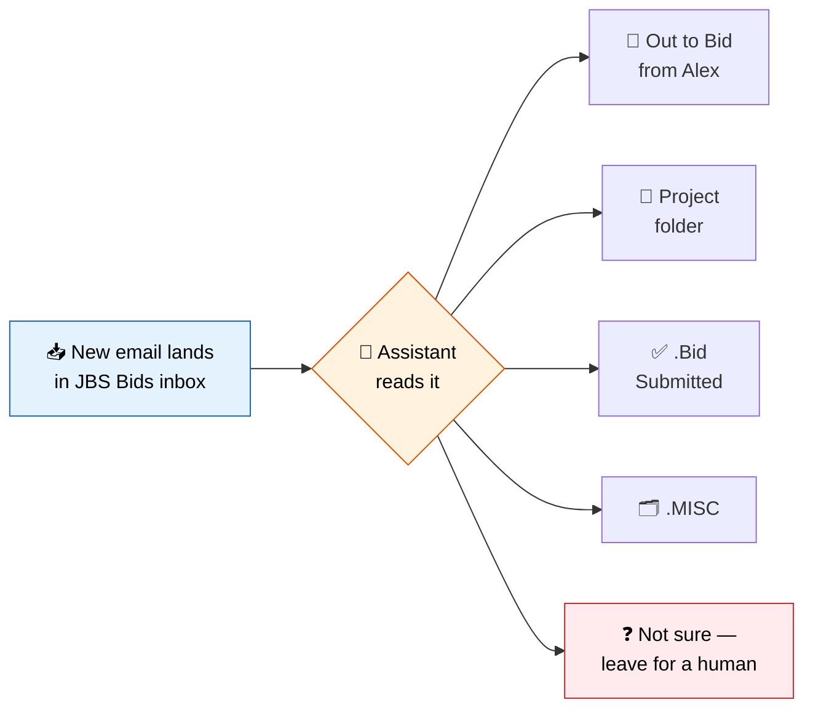
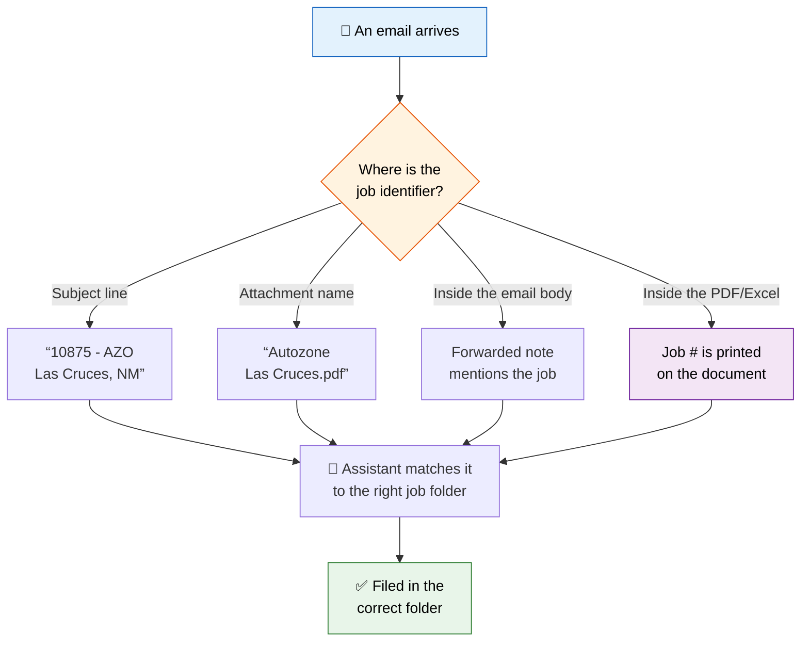
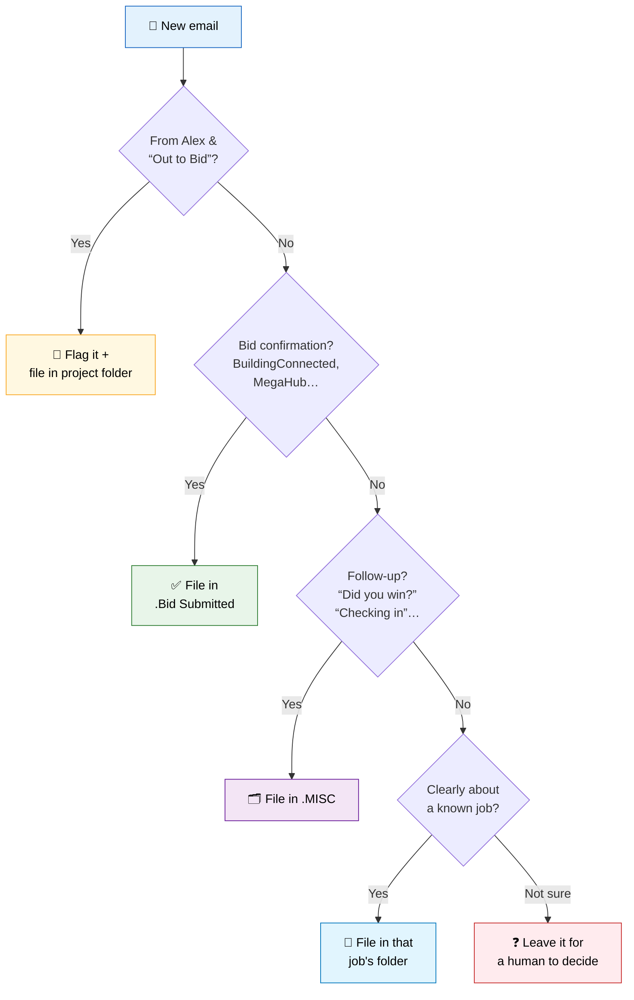
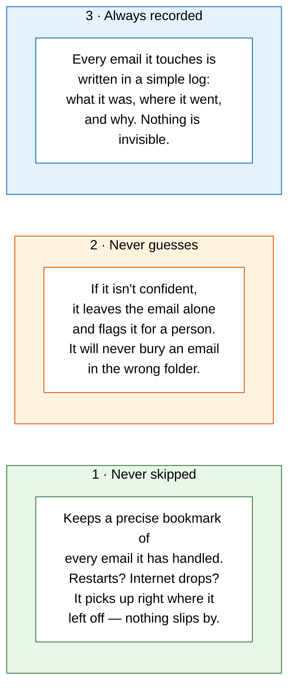
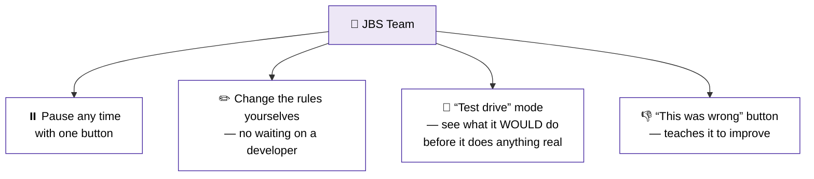
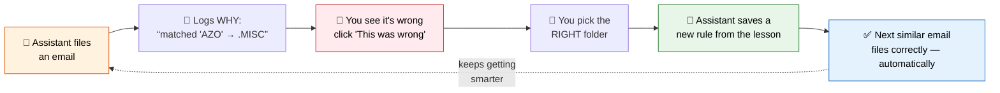
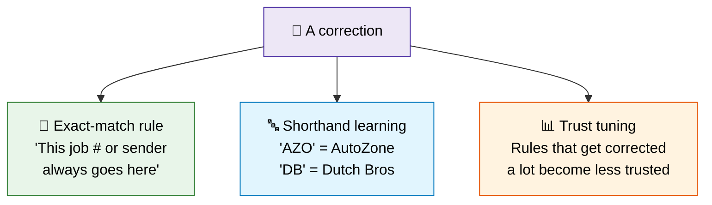
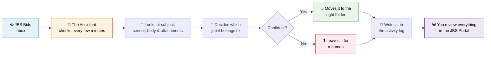
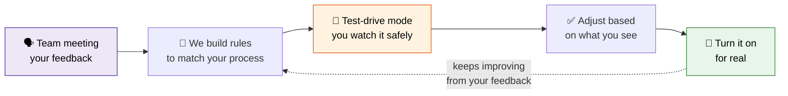

# 📬 JBS Bids Inbox — Automatic Email Organizer
### A plain-English overview for the team

---

## 🎯 The problem we're solving

The JBS Bids inbox gets a **huge** amount of email. Today, someone has to read each
one and drag it into the right folder by hand. It's slow, it's repetitive, and it's
easy to fall behind.

We're building a behind-the-scenes **assistant** that does this sorting for you —
automatically, around the clock — the same way you'd do it yourself.

---

## 🧭 How it decides where an email goes

This is the heart of the whole project — and the part where we need your help.

To file an email correctly, the assistant has to answer one question:
**"Which job is this email about?"**

The tricky part: the clue that answers that question can be hiding in different
places depending on the email.

So the assistant doesn't just glance at the subject line — it looks at the **whole
email, including attachments**, to find the identifier that tells it where the email
belongs. Mapping out *where these clues usually live* is the #1 thing we want to work
through together next week.

> 🔒 **A note on privacy.** "Reading" here just means the assistant scans the email's
> words and attachment details to find which job it relates to — only to sort it. **No
> person reads your email.** The assistant never replies, forwards, edits, or deletes
> anything. It only **moves** and **flags**, exactly like you do by hand.

---

## 🗂️ The sorting rules (today's starting point)

Here's how the assistant sorts, based on the process we've seen so far:

These rules are just the **starting point** — your feedback next week will shape them.

---

## 🛡️ Our #1 promise: no email gets lost or misfiled

This matters more than anything else, so we built in three safety nets:

---

## 🎛️ You're always in control

- **⏸️ Pause any time** with one button.
- **✏️ Change the rules yourselves.** If a certain kind of email should start going
  somewhere new, you adjust a rule right in the portal.
- **🧪 "Test drive" mode.** Before we go live, the assistant runs in a preview mode that
  shows you *what it would have done* without moving anything. You check its work and
  build trust first.
- **👎 Tell it when it's wrong.** If it misfiles something, you click "this was wrong" in
  the log, and we use that to make it smarter.

---

## 🧠 How it learns from you

Here's the best part: **the assistant gets smarter every time you correct it** — and it
does this in a way that's completely transparent. There's no mysterious "black box." When
it learns something, you can always see exactly *what* it learned and *why*.

### The core idea: a correction becomes a new rule

Every time the assistant files an email, it writes down **why** it made that choice — which
clue it used (a sender, a keyword, a job number, an attachment name). So when you say "that
was wrong," it already knows what it *thought*. You tell it what it *should* have been, and
the gap between those two becomes the lesson.

### A real example

Say this email comes in and the assistant guesses wrong:

> **Subject:** "Fw: Bid Documents - 10875 - AZO Las Cruces, NM"
> The assistant filed it in **.MISC** because it didn't recognize "AZO."

You see it, click **"This was wrong,"** and pick the correct folder: **AZ-Las Cruces NM**.

Now the assistant asks itself: *"What in this email should have pointed to that folder?"*
It finds the clues and saves the strongest ones as new rules:

| Clue it spotted | New rule it learns |
|---|---|
| Job number **10875** | "Job number 10875 → AZ-Las Cruces NM folder" *(rock solid)* |
| The word **AZO** | "AZO means AutoZone" *(a new shorthand it learns)* |
| **Las Cruces** in the text | "Las Cruces → AZ-Las Cruces NM" *(location match)* |

The **next** email mentioning 10875 or AZO Las Cruces files itself correctly — no human needed.

### Three kinds of lessons it learns

1. **Exact-match rules** — the most reliable. A job number or sender that *always* maps to
   one folder. Once learned, it's basically never wrong again.
2. **Shorthand (aliases)** — the assistant builds a little dictionary of JBS's own
   shorthand. "AZO" → AutoZone, "DB" → Dutch Bros. This is huge for the "weird ways" emails,
   because the team uses shorthand the computer doesn't know yet — until you teach it.
3. **Trust tuning** — if a particular guessing rule keeps getting corrected, the assistant
   automatically stops trusting it and routes those emails to "Needs Review" instead of
   guessing.

### Why we built it this way (and not as "AI that figures it out")

This is what keeps your #1 promise — *no misfiling* — believable:

- **Every decision is explainable.** You can always ask "why did it file this here?" and get
  a plain answer ("because of rule: job # 10875"). A guess-it-yourself AI can't show its
  reasoning — and "never misfile" *requires* being able to see the reasoning.
- **Corrections are permanent and instant.** Fix it once, it's fixed forever. No waiting.
- **The team is in charge, not the computer.** You teach it; it never overrules you.
- **It improves fastest exactly where it matters** — on *your* real emails, *your* shorthand,
  *your* jobs.

### One honest caveat

The assistant can only learn a lesson if the correction gives it something to grab onto. If
an email has **no** identifiable clue anywhere — no job number, no recognizable name in the
subject, body, or attachments — then correcting it fixes that one email but won't
generalize. That's rare, but it's exactly why the "tricky cases" questions below matter: we
want to learn how *people* tell those apart, so we can teach the assistant the same trick.

---

## 🚫 What it will NOT do

- ❌ It will **not** reply to, write, forward, or delete any emails.
- ❌ It will **not** create brand-new project folders on its own. When a new job comes
  in, someone still makes the folder in Outlook, then clicks **"Sync"** so the assistant
  learns about it.

---

## 🗺️ The big picture (how it all fits together)

---

## 🙋 What we need from you

The example we received shows **one person's** way of sorting. We want to capture
**everyone's** approach so the assistant matches how the whole team really works.

Please come ready to talk through these:

### 🔍 Finding the right folder
1. When an email comes in, what do you look at **first** to decide where it goes —
   the subject, the sender, the attachment, something else?
2. Where does the **job number or project name** usually show up? Subject line?
   Attachment file name? Inside the PDF? Does it vary?
3. Are the **attachment file names** usually reliable, or are they inconsistent?
4. Are there times you have to **open the attachment** to know where the email goes?

### 📋 The rules
5. Are there sorting rules you follow that **weren't** in the original example?
6. Are there specific **senders** that should *always* go to a specific folder?
7. Are there **words or phrases** that always mean "this is a follow-up" (→ .MISC)
   versus "this is an active job"?

### 🤔 The tricky cases
8. What are the **"weird" emails** that are hard to sort even for a person?
9. When two jobs look similar (**same brand, different city**), how do you tell
   them apart?
10. When you're **unsure** where an email goes today, what do you do with it?

### 📌 The flagging
11. Does Alex's "Out to Bid" email need to literally **pin to the top** of the folder,
    or just be **flagged/starred** so it's easy to spot?

---

## ⏭️ What happens after the meeting

This is built to be **tuned over time** — your feedback is what makes it accurate.

---

> 💡 **Presenter tip:** The diagrams in this document render automatically in **GitHub**
> or the **VS Code Markdown preview** (open the file and press `Cmd+Shift+V`). To use them
> in PowerPoint or Google Slides, open the preview and take a screenshot of each diagram.

*Questions before the meeting? Reach out any time.*
